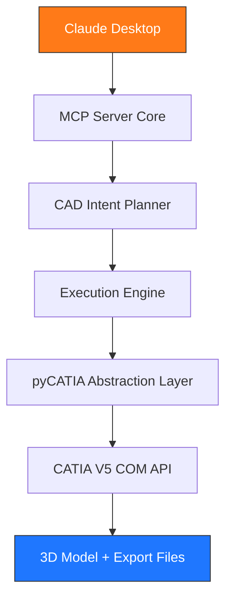

  

<h1 align="center">🚀 CATIClaude</h1>

AI-Powered CATIA V5 Automation through the Model Context Protocol

## ⭐ Badges

## 🧠 Overview

CATIClaude is a production-grade Model Context Protocol (MCP) server that connects Claude Desktop directly to CATIA V5 through pyCATIA COM automation.

It enables engineers to design real mechanical parts using natural language — and automatically generate:

CATPart files
STEP / IGES exports
Fully parametric 3D geometry

Example:

“Design a lightweight L-bracket with 120mm base, 10mm thickness, and 2 mounting holes”

➡️ CATIA automatically builds the full 3D model.

## 🏛 Design Philosophy

CATIClaude is designed around one central principle:

> AI should describe engineering intent—not low-level CAD operations.

Instead of exposing the complexity of the CATIA COM API to the user,
CATIClaude translates natural language into deterministic CAD operations
through a layered planning architecture.

This keeps the interface simple while maintaining engineering reliability.

## ⚙️ Key Idea

Instead of manually modeling in CAD software:

🧠 English → AI Planning → MCP Tools → CATIA V5 → Real Geometry

## 🚀 Roadmap

- [x] CATIA V5 integration
- [x] MCP Server
- [x] Natural-language CAD
- [x] STEP export
- [x] Parametric editing
- [ ] Assembly generation
- [ ] Drafting automation
- [ ] Multi-agent engineering workflow
- [ ] AI optimization tools
- [ ] CATIA V6 support

## 🏗️ System Architecture

## 🧩 Architecture Layers

| Layer | Component            | Responsibility                       |
| ----- | -------------------- | ------------------------------------ |
| 1     | MCP Server Core      | Tool routing + FastMCP interface     |
| 2     | CATIA Session Engine | Stable COM session management        |
| 3     | pyCATIA Abstraction  | Safe wrapper over CATIA API          |
| 4     | CAD Intent Planner   | Natural language → structured design |
| 5     | Execution Engine     | Step-by-step CAD construction        |

## 📁 Project Structure

    catia_mcp/
    
    ├── catia/
    ├── core/
    ├── engine/
    ├── tools/
    ├── utils/
    ├── tests/
    ├── config/
    ├── server.py
    ├── requirements.txt
    └── README.md

## 🧠 Core Features

🔹 Natural Language 

CAD Convert text → real CAD geometry
Supports brackets, plates, shafts, housings

🔹 Robust CATIA Session Engine

Singleton COM connection
Auto-reconnect on crash
Safe multi-call execution

🔹 Sketch Intelligence

Automatic sketch closure validation
Prevents invalid Pad/Pocket operations

🔹 Parametric Design Support

Named parameters
Real-time geometry updates

🔹 Export Pipeline

STEP / IGES / STL export
Automatic file generation

## ✨ Features

- Natural-language CAD generation
- Rule-based CAD planning engine
- Stable CATIA COM session management
- Automatic geometry validation
- Parametric modeling support
- STEP / STL / IGES export
- Thread-safe MCP execution
- Retry & recovery system
- Structured JSON responses
- Mock-based testing
- Production-ready architecture

## 🔄 Execution Pipeline

User Prompt

   ↓
   
Intent Parser

   ↓
   
CAD Planner

   ↓
   
Validator

   ↓
   
Executor

   ↓
pyCATIA Wrapper

   ↓
   
CATIA V5 Model

   ↓
   
Exported CAD Files

## 🛠 Available MCP Tools

### Document

- create_part
- open_document
- save_document
- close_document

### Sketch

- create_sketch
- add_line
- add_circle
- add_rectangle
- close_sketch

### Features

- pad
- pocket
- hole
- fillet
- chamfer

### Parameters

- set_parameter
- get_parameter
- list_parameters

### Analysis

- get_tree
- get_edges
- measure_distance
- get_mass_properties
- validate_geometry

### Export

- export_step
- export_iges
- export_stl

### AI Design

- design_from_text

## 💡 Example Usage

1. L-Bracket

       Design a lightweight L-bracket with:
       Base length: 120mm
       Thickness: 10mm
        2 mounting holes

2. Shaft

       Create a 20mm diameter, 150mm long steel shaft.

3. Enclosure

        Design a hollow box:
        150 × 90 × 60 mm
        Wall thickness: 3mm
        Export STEP file

## 🧪 Reliability Engineering

   🔁 Automatic retry system (COM-safe)

   🧯 Crash recovery for CATIA sessions
  
   🧩 Geometry validation before operations

   🧠 Structured error system (no raw tracebacks)
   
   🔒 Global execution lock (thread-safe MCP)
  
   📜 Full audit logging for every CAD action

## ⚠️ CATIA Compatibility Note

Some CATIA V5 versions differ in COM APIs.

To ensure stability:

Hole feature is implemented via sketch + pocket fallback
Fillet/Chamfer uses stable ShapeFactory calls
Only feature_manager.py may require version-specific tweaks

## 🧰 Installation

Requirements 

Windows 10,11 / 
CATIA V5 (R20+ recommended) /
Python 3.10+ /
pywin32 / 
pycatia 

Setup

        git clone https://github.com/YOUR_USERNAME/catia-claude-mcp
        cd catia-claude-mcp

        pip install -r requirements.txt
        python -m pywin32_postinstall -install

Run Server

        python server.py

Connect to Claude Desktop

Edit:

        %APPDATA%\Claude\claude_desktop_config.json

JSON :  

        {
          "mcpServers": {
            "catia": {
              "command": "C:\\Python\\python.exe",
              "args": ["C:\\path\\to\\catia_mcp\\server.py"]
            }
          }
        }       

## 📦 Output

.CATPart

.STEP

.IGES

.STL        

## 🧪 Testing

        pytest -q

Mock-based tests (no CATIA required).        

## 🌍 Why This Project Matters

This project explores:

AI × Mechanical Engineering automation

Natural language CAD systems

Multi-agent engineering workflows

Future of design engineering interfaces        

## 🤝 Contributing

Contributions are welcome.

If you would like to improve CATIClaude:

1. Fork the repository
2. Create a feature branch
3. Commit your changes
4. Open a Pull Request

## 📜 License

This project is released under the MIT License.

See the LICENSE file for details.

## 🙏 Credits

Built with:

- Claude Desktop
- Model Context Protocol (MCP)
- pyCATIA
- Python
- CATIA V5 COM Automation

Special thanks to the open-source communities behind these projects.

## 📖 Citation

If you use this project in your research or engineering workflow,
please consider citing the repository and giving it a GitHub star.

## 👤 Author

**Pouya Bagheri**

Mechanical Engineering Student

Interests

- AI for Engineering
- CAD Automation
- Mechanical Design
- Digital Manufacturing
- Model Context Protocol
- Engineering Intelligence

LinkedIn:
 www.linkedin.com/in/pouyabagheri

Gmail:
 pouya.bagheri.2005@gmail.com

 ---

If this project helped you,
consider giving it a ⭐ on GitHub.

