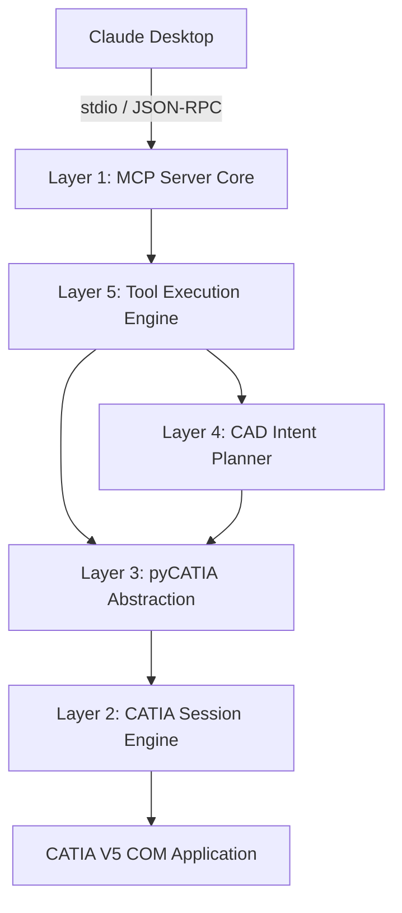

# CATIA V5 MCP Server

A production-grade [Model Context Protocol](https://modelcontextprotocol.io) server
that lets **Claude Desktop** design real 3D geometry in **CATIA V5** through
natural language, via [pyCATIA](https://github.com/evereux/pycatia) COM
automation.

> "Design a lightweight L-bracket with 120mm base, 10mm thickness, and 2
> mounting holes" -> a real, exported `.CATPart` + STEP file.

This is not a demo script. It is a layered engineering automation system with
a session engine, a pyCATIA abstraction layer, a CAD intent planner, retrying
execution, structured error handling, and a test suite.

---

## 1. Architecture



| Layer | Location | Responsibility |
|---|---|---|
| 1. MCP Server Core | `server.py`, `core/` | FastMCP app, tool registry, routing, tracing, a global execution lock |
| 2. CATIA Session Engine | `catia/session.py` | Singleton COM connection: start/attach, liveness probe, reconnect |
| 3. pyCATIA Abstraction | `catia/*.py` | `PartManager`, `SketchManager`, `FeatureManager`, `ExportManager`, `ParameterManager`, `AnalysisManager` - the ONLY code that touches `pycatia` |
| 4. CAD Intent Planner | `engine/intent_parser.py`, `engine/cad_planner.py`, `engine/validator.py` | NL -> structured plan, unit normalization, defaults with explicit assumptions, feasibility checks |
| 5. Execution Engine | `engine/executor.py` | Step-by-step plan execution, per-step error capture, operation history |

### Execution pipeline


Claude can drive this pipeline two ways:

1. **Atomic tools** - Claude itself acts as the intent parser/planner and
   calls `create_sketch`, `add_rectangle`, `pad`, ... one at a time. This is
   the most flexible path and works for anything.
2. **`design_from_text`** - a single high-level tool that runs a
   deterministic, rule-based version of layer 4 for four common shapes
   (bracket, plate, shaft, housing) end-to-end in one call.

Both paths share the exact same manager singletons (`catia/managers.py`), so
session state (active document/sketch/body) is always consistent.

### Project structure

```
catia_mcp/
├── server.py                 # MCP entry point (stdio transport)
├── core/
│   ├── mcp_router.py          # binds tool_registry -> FastMCP, tracing, global lock
│   ├── tool_registry.py       # framework-agnostic tool collection
│   └── state_manager.py       # singleton session/document/sketch/feature state
├── catia/
│   ├── session.py             # Layer 2: COM session, reconnect logic
│   ├── pycatia_wrapper.py     # shared low-level pyCATIA helpers
│   ├── managers.py            # shared manager singletons
│   ├── part_manager.py
│   ├── sketch_manager.py
│   ├── feature_manager.py
│   ├── export_manager.py
│   ├── parameter_manager.py
│   └── analysis_manager.py
├── engine/
│   ├── intent_parser.py       # NL -> DesignIntent
│   ├── cad_planner.py         # DesignIntent -> ordered step list
│   ├── validator.py           # geometry feasibility checks
│   └── executor.py            # runs a plan step-by-step
├── tools/
│   ├── document_tools.py      # create_part, open/save/close_document
│   ├── sketch_tools.py        # create_sketch, add_line/circle/rectangle, close_sketch
│   ├── feature_tools.py       # pad, pocket, hole, fillet, chamfer
│   ├── analysis_tools.py      # get_tree, get_edges, measure_distance, get_mass_properties, validate_geometry
│   ├── export_tools.py        # export_step/iges/stl
│   ├── parameter_tools.py     # set/get/list_parameter (bonus, parametric edits)
│   └── design_tools.py        # design_from_text (high-level NL pipeline)
├── utils/
│   ├── logger.py               # rotating file logs (stdout reserved for MCP!)
│   ├── error_handler.py        # exception hierarchy + retry decorator
│   ├── units.py                 # mm normalization
│   └── response.py              # {success, data, error, context} envelope
├── tests/
├── config/claude_desktop_config.json
├── requirements.txt
└── README.md
```

---

## 2. Reliability design

- **COM failure recovery**: `CatiaSession.is_alive()` probes `documents.count`
  before every use; a dead session triggers a fresh `_connect()` transparently.
- **Retry**: every mutating pyCATIA call is wrapped with
  `utils.error_handler.retry(max_retries=2)` (3 total attempts), except
  validation errors, which are never retried (retrying bad input is pointless).
- **Sketch closure enforcement**: `SketchManager.is_closed()` checks that
  circles/rectangles are self-closing or that a set of lines forms a closed
  polygon (every vertex shared by exactly two segment endpoints).
  `FeatureManager.pad/pocket` refuse to run against an open sketch.
- **Structured errors**: `CatiaConnectionError`, `CatiaOperationError`,
  `GeometryValidationError`, `PlanningError` all map to
  `{"success": false, "error": "..."}` - Claude always gets a clear reason,
  never a raw traceback.
- **Single active session**: `CatiaSession` and every manager in
  `catia/managers.py` are singletons; `core/mcp_router.py` serializes tool
  calls with a global lock so the single COM session is never accessed
  concurrently.
- **Full audit trail**: every tool call is logged to
  `logs/tool_trace.log`; CAD operations are logged to
  `logs/catia_mcp.log`; `state.get_history()` exposes the in-memory
  operation log for the current session.

### A note on `hole`/`fillet`/`chamfer` and CATIA versions

CATIA V5's native `ShapeFactory.AddNewHole` COM signature has changed across
releases (R19 through R2023x). To stay robust across versions, `hole()` is
implemented as a circular sketch + pocket (mechanically equivalent, always
available). `fillet()`/`chamfer()` use `AddNewEdgeFilletWithConstantRadius`
and `AddNewChamfer`, which are more stable, but if your release's signature
differs, the only file you need to touch is `catia/feature_manager.py` - no
other layer depends on the exact COM call shape.

---

## 3. Installation (Windows + CATIA V5)

**Prerequisites**
- Windows 10/11
- CATIA V5 (R20 or later recommended) installed and licensed
- Python 3.10+ (a normal, non-Store install; must be able to load `pywin32`)

**Steps**

1. Copy the `catia_mcp/` folder anywhere on the machine that has CATIA V5,
   e.g. `C:\tools\catia_mcp`.
2. Install dependencies:
   ```powershell
   cd C:\tools\catia_mcp
   python -m pip install -r requirements.txt
   python -m pywin32_postinstall -install   # if pywin32 asks for this
   ```
3. Start CATIA V5 once manually the first time (license/activation dialogs
   should be dismissed interactively before automating).
4. Smoke-test the server directly:
   ```powershell
   python server.py --debug
   ```
   It should print nothing to stdout (MCP reserves stdout for protocol
   traffic) and start logging to `logs/catia_mcp.log`. Press Ctrl+C to stop.
5. Run the test suite (uses mocks, does not require CATIA to be running):
   ```powershell
   python -m pip install pytest pytest-mock
   python -m pytest -q
   ```

### Wiring into Claude Desktop

Edit (or create) `%APPDATA%\Claude\claude_desktop_config.json` and merge in
the contents of `config/claude_desktop_config.json`, updating the paths:

```json
{
  "mcpServers": {
    "catia": {
      "command": "C:\\Path\\To\\Python\\python.exe",
      "args": ["C:\\Path\\To\\catia_mcp\\server.py"],
      "env": {}
    }
  }
}
```

Restart Claude Desktop. A hammer/tools icon in the chat box should list the
`catia` tools (`create_part`, `add_rectangle`, `pad`, `design_from_text`, ...).

---

## 4. Example prompts

**Bracket** (uses the high-level planner):
> Design a lightweight L-bracket with 120mm base, 10mm thickness, and 2
> mounting holes.

**Shaft**:
> Create a 20mm diameter, 150mm long steel shaft.

**Mechanical housing** (hollow box):
> Design an enclosure 150mm long, 90mm wide, 60mm tall, with 3mm wall
> thickness, and export it to STEP.

**Fully manual / atomic control** (for anything the presets don't cover):
> Create a new part called "Gusset". Create a sketch on the XY plane, draw a
> triangle with lines from (0,0) to (80,0), (80,0) to (0,60), and (0,60) to
> (0,0), close the sketch, then pad it 6mm. Fillet all edges 2mm and export
> to STEP at C:\parts\gusset.stp.

**Dry run** (plan only, no CATIA calls):
> Use design_from_text with execute=false to show me the plan for "a plate
> 200mm x 100mm x 8mm with 4 mounting holes" before you run it.

---

## 5. Tool reference

| Category | Tools |
|---|---|
| Document | `create_part`, `open_document`, `save_document`, `close_document` |
| Sketch | `create_sketch`, `add_line`, `add_circle`, `add_rectangle`, `close_sketch` |
| Feature | `pad`, `pocket`, `hole`, `fillet`, `chamfer` |
| Analysis | `get_tree`, `get_edges`, `measure_distance`, `get_mass_properties`, `validate_geometry` |
| Export | `export_step`, `export_iges`, `export_stl` |
| Parameters | `set_parameter`, `get_parameter`, `list_parameters` |
| Natural language | `design_from_text` |

Every tool returns:

```json
{
  "success": true,
  "data": { "...": "..." },
  "error": null,
  "context": {
    "active_document": "Part1.CATPart",
    "active_part": "Part1",
    "active_body": "PartBody",
    "active_sketch": null,
    "last_feature": "Pad.1",
    "feature_count": 1
  }
}
```

---

## 6. Testing

`tests/` uses `unittest.mock` to fake pyCATIA/COM objects, so the full suite
runs on any OS without CATIA installed:

```powershell
python -m pytest -q
```

Covers: sketch closure detection, pad/pocket/hole guard rails, session
reconnect after a simulated COM crash, intent parsing, CAD plan generation,
plan validation, and executor step dispatch/failure handling.

Integration testing against a real CATIA session (sketch creation, feature
generation, STEP export) must be run manually on a licensed Windows/CATIA
machine, since no CI environment here has a CATIA V5 license.
